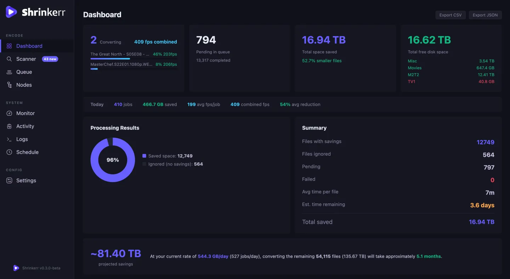

<div align="center">


**Save space, bandwidth & money while retaining quality.**

[](https://github.com/I-IAL9000/shrinkerr/actions/workflows/build-images.yml)


[](LICENSE)

</div>

---

Shrinkerr scans your media library, identifies files that are worth re-encoding, queues them up, and runs `ffmpeg` in the background — replacing each file with a smaller x265 copy only when the quality check passes. It's designed for home media servers (Plex, Jellyfin, Emby) where you want to reclaim drive space without hand-rolling ffmpeg scripts.

Typical result on a mixed TV + movies library: **50–65% smaller files** with no visible quality loss, fully automated, with originals optionally retained in a backup folder for easy rollback.

<div align="center">



</div>

> 📚 **[Full documentation in `/docs`](docs/README.md)** — installation
> scenarios, encoding guide, remote-worker setup, rules & automation,
> best practices, troubleshooting, FAQ.

## Features

**Encoding**
- x264 (or any other source codec) → x265 (HEVC) conversion, NVENC hardware or libx265 CPU
- Per-resolution CQ/CRF overrides (4K, 1080p, 720p, SD)
- Encoding rules — by directory / source / resolution / file size / codec, by Plex label / collection / genre / library, or by Sonarr / Radarr tag
- Optional [VMAF](https://github.com/Netflix/vmaf) quality check with a configurable minimum score — encodes that score below the threshold are discarded and the original is kept
- **Dry run** — fire off a 30-second test encode before committing to a full job and get its VMAF score back, so you can validate your settings on a single clip without burning 20 minutes on a bad preset
- Automatic fallback from NVENC → libx265 when the requested encoder isn't available on a node
- Multiple parallel jobs per host, capped by a `parallel_jobs` setting
- Built-in conversion guide + quick-action presets for common scenarios

**Library management**
- Recursive scanner with ffprobe-based codec / bitrate analysis
- TMDB metadata + native-language lookup so the audio/subtitle cleanup rules know which language is the original
- Audio track cleanup — keep only the languages you want, drop commentary / descriptive tracks
- Subtitle track cleanup — same as audio, plus detection of forced / SDH / CC variants
- External subtitle detection — sidecar `.srt` / `.ass` / `.sub` files show up next to embedded ones and can be merged into the output during conversion
- Health check — probes files for corruption before (and optionally after) encoding
- File-level ignore list with one-click restore
- Extensive filter system + advanced search — match on any attribute (codec, resolution, size, bitrate, audio languages, native language, Plex metadata, …)
- Watch folders — new files appear in the scanner view automatically
- Poster grid view with TMDB artwork for visual browsing

**Automation**
- Queue with drag-and-drop reordering, bulk apply, priority levels, and scheduling
- Watch folders — auto-queue newly-added files in real time
- NZBGet / SABnzbd post-processing scripts — auto-queue freshly-downloaded releases
- Sonarr / Radarr integration — trigger replacement searches, upgrade searches, and missing-episode searches without leaving the UI; library refresh on completion
- Plex / Jellyfin integration — label / collection / genre / library-based rules, watch-status sync, library refresh on completion, trash cleanup
- Scheduling — only encode during off-peak hours, pause around Plex / Jellyfin prime-time
- Post-conversion hook scripts with rich env-var context (job details, space saved, [VMAF](https://github.com/Netflix/vmaf) score, etc.)
- Batch rename with Plex-friendly patterns, with optional auto-rename after conversion
- File-size / bitrate threshold filters on the conversion queue (skip tiny files, skip already-low-bitrate files)
- Custom ffmpeg flags per job or per rule
- Notifications via Discord / Telegram / email / webhook

**Distributed workers**
- Offload encoding to remote hosts (second machine, gaming PC, ARM box)
- Capability-aware job routing (NVENC jobs go to NVENC hosts, CPU jobs anywhere)
- Per-node pause / affinity / schedule / concurrency limits
- Path-mapping support for workers that see the library at a different path
- Circuit breaker auto-pauses a node after repeated failures

**Monitoring & statistics**
- Live dashboard — active jobs, queue depth, total saved, projected savings
- System monitor — GPU (utilization, VRAM, temp, NVENC/NVDEC load), CPU, RAM, disk I/O, network, Plex stream count
- 90-day trend charts — cumulative savings, daily encodes, avg FPS per job
- Library breakdown — codecs, resolutions, source types, native languages, audio track languages
- [VMAF](https://github.com/Netflix/vmaf) score distribution + per-job quality breakdown
- Activity log — every scan, encode, ignore, arr action, Plex sync — with timestamps

**Safety net**
- Keep originals for N days in a per-directory `.shrinkerr_backup` folder, or centralize to one path
- **Undo conversion** — restore any recently-encoded file to its original with one click
- Automatic detection of "no savings" encodes → keep the original, mark the file as ignored
- Output verification — ffmpeg must successfully encode AND the output must be non-empty before the original is touched
- Automatic retry with directory-scan fallback for transient NFS/SMB filesystem glitches

**Quality of life**
- Dark + light theme
- Queue/dashboard updates via WebSocket — no page refresh needed
- Bulk-edit selected jobs (encoder, preset, CQ, priority, audio codec)
- Settings export/import (JSON) for easy migration
- Full backup/restore (includes DB + media-dir config + encoding rules)
- Keyboard shortcuts for navigation and queue start/pause
- Tab-visibility-aware polling — pauses background fetches when the tab isn't visible

---

## Requirements

- **Docker 20.10+** with **Docker Compose V2** (the built-in `docker compose` subcommand, not legacy `docker-compose`)
- **Media library** on a filesystem Docker can bind-mount with read + write access
- **Port 6680** free on the host (or another port of your choosing)
- **For NVENC (optional, 5–10× faster than CPU)**:
  - NVIDIA GPU (Pascal / GTX 10xx or newer)
  - NVIDIA driver 525.60.13+ (for `:nvenc`) or 570+ (for `:edge-nvenc`)
  - **Linux**: [NVIDIA Container Toolkit](https://github.com/NVIDIA/nvidia-container-toolkit)
  - **Windows**: Docker Desktop in WSL2 mode (Windows 10 21H2+ / Windows 11) with a recent NVIDIA Windows driver — nothing else to install
  - **macOS**: not supported — Apple Silicon has no NVIDIA path; use the portable `:latest` image

---

## Image variants

Four tags are published to [ghcr.io/i-ial9000/shrinkerr](https://github.com/I-IAL9000/shrinkerr/pkgs/container/shrinkerr):

| Tag | Platforms | Encoding | When to use |
|---|---|---|---|
| `:latest` | linux/amd64 + linux/arm64 | libx265 (CPU only) | **Default.** Works on Mac, Windows, Linux, Raspberry Pi, ARM cloud. Pick this unless you specifically want GPU. |
| `:edge` | linux/amd64 + linux/arm64 | libx265 (CPU only) | Same as `:latest` but with bleeding-edge ffmpeg master build. |
| `:nvenc` | linux/amd64 | NVENC + libx265 | NVIDIA GPU host on Linux or Windows+WSL2. ffmpeg n7.1, needs driver 525.60.13+. |
| `:edge-nvenc` | linux/amd64 | NVENC + libx265 | NVIDIA GPU host running a very recent driver. ffmpeg master, needs driver 570+. |

**All variants share the same database schema and settings format** — you can switch between them with a single `image:` line change and a `docker compose pull && docker compose up -d`. The app's runtime capability detection handles the encoder difference transparently.

---

## Quick start

### Option A — Portable (works on any host, CPU encoding)

This is the recommended starting point, even on a GPU host, because it lets you validate the setup before layering on NVENC.

```yaml
# docker-compose.yml
services:
  shrinkerr:
    image: ghcr.io/i-ial9000/shrinkerr:latest
    container_name: shrinkerr
    ports:
      - "6680:6680"
    volumes:
      - ./data:/app/data                 # Shrinkerr's SQLite DB + logs + history
      - /srv/media:/media                # YOUR media library (read + write)
    restart: unless-stopped
```

```bash
docker compose up -d
```

Open <http://localhost:6680>. On first launch, go to **Settings → System → Authentication** and set a username and password before exposing the port beyond localhost.

### Option B — With NVENC (Linux + NVIDIA GPU)

```yaml
services:
  shrinkerr:
    image: ghcr.io/i-ial9000/shrinkerr:nvenc
    container_name: shrinkerr
    ports:
      - "6680:6680"
    volumes:
      - ./data:/app/data
      - /srv/media:/media
    environment:
      - NVIDIA_VISIBLE_DEVICES=all
    restart: unless-stopped
    runtime: nvidia                      # Linux with NVIDIA Container Toolkit
    deploy:
      resources:
        reservations:
          devices:
            - driver: nvidia
              count: all
              capabilities: [gpu, video]
```

**Windows (Docker Desktop WSL2)**: same file, but **remove** the `runtime: nvidia` line. Docker Desktop doesn't register a `nvidia` runtime by name; the `deploy:` block is the cross-platform way.

A heavily-commented production template is at [`docker-compose.portainer.yml`](docker-compose.portainer.yml) — copy it, adjust the paths, and paste into Portainer.

---

## First-time setup

After `docker compose up -d` the setup wizard walks you through four steps:

1. **Add media directories** — Settings → Directories. Point at `/media/TV`, `/media/Movies`, etc. (whatever paths exist inside the container mount).
2. **Scan your library** — Scanner → select paths → Scan. Shrinkerr probes each file with ffprobe and classifies it.
3. **Connect Plex (optional)** — Settings → Connections → Plex. Enables label-based rules and automatic library refresh.
4. **Start converting** — Queue → Start. Watches run 1 job at a time by default; the Nodes page lets you bump this to match your hardware.

You can skip 1 and 3 and go straight to manual encoding via Scanner → Add selected to queue.

---

## Workflows

<details>
<summary><b>Encode a library</b></summary>

1. **Scanner** → pick directories → **Scan**. Takes 5-30 minutes per 10k files depending on disk speed.
2. Filter by codec (show x264 only), by resolution (1080p+), by size, or by any attribute via the search bar / advanced filter panel.
3. Select a subset → **Add selected to queue**. An estimate modal shows expected space saved + estimated time.
4. **Queue** → **Start**. Shrinkerr encodes in the background and updates the UI live via WebSocket.
5. Files are replaced in place. Originals go to `.shrinkerr_backup` (or the trash, or permanently deleted — configurable).

</details>

<details>
<summary><b>Audio/subtitle cleanup</b></summary>

Many Blu-ray rips ship with 5+ audio tracks (commentary, descriptive audio, foreign-language dubs) and 20+ subtitle tracks. Shrinkerr can strip the ones you don't want without re-encoding video.

1. **Settings → Audio / Subtitles** — set your "always keep" languages (e.g. `eng, isl`) and optionally ignore unknown-language tracks.
2. Scanner flags files with removable tracks.
3. Add to queue → Shrinkerr runs an ffmpeg stream-copy (fast, no quality loss) with the unwanted tracks dropped.

</details>

<details>
<summary><b>Sonarr/Radarr — request a replacement</b></summary>

For a corrupt or low-quality file already on disk:

1. Queue → Completed/Failed tab → click the file → **Request replacement**.
2. Shrinkerr blocklists the current release in Sonarr/Radarr, deletes the file from disk, and triggers a fresh search.
3. Or use **Search for upgrades** / **Search for missing** as bulk actions across a directory.

</details>

<details>
<summary><b>NZBGet / SABnzbd integration</b></summary>

Auto-queue freshly-downloaded releases so they start encoding the moment Sonarr/Radarr hands them off.

1. Settings → Automation → **Download NZBGet script** (or SABnzbd).
2. Drop the downloaded script into your downloader's scripts folder.
3. Your server URL and API key are baked in — no further config.

Files with nzb-assigned categories / tags you configure in the Shrinkerr UI will be queued automatically after the download completes.

</details>

<details>
<summary><b>Distributed encoding — add a worker node</b></summary>

Offload encoding to a second machine (gaming PC, idle NUC, ARM server).

1. On the main server: Settings → Nodes → **Create worker API key**.
2. On the worker host, deploy the same image in worker mode:

   ```yaml
   services:
     shrinkerr-worker:
       image: ghcr.io/i-ial9000/shrinkerr:latest    # or :nvenc for a GPU worker
       environment:
         - SHRINKERR_MODE=worker
         - SERVER_URL=http://<main-host-ip>:6680
         - API_KEY=<paste-the-key-here>
         - WORKER_NAME=gaming-pc
         - CAPABILITIES=nvenc,libx265               # advertise what this box can do
         # If the worker sees the library at a different path than the server:
         # - PATH_MAPPINGS=[["/media","/mnt/nas"]]
       volumes:
         - /mnt/nas:/media                          # must match PATH_MAPPINGS or the server's path
       restart: unless-stopped
   ```

3. `docker compose up -d`. The worker registers itself and appears on the Nodes page within 30 seconds.

NVENC workers need the same GPU passthrough config as the main server (`runtime: nvidia` + `deploy:` devices on Linux).

</details>

---

## Configuration

### Environment variables

| Variable | Default | Purpose |
|---|---|---|
| `SHRINKERR_DB_PATH` | `/app/data/shrinkerr.db` | SQLite database file path |
| `SHRINKERR_MEDIA_ROOT` | `/media` | Container-side root of the media library |
| `SHRINKERR_MODE` | `server` | Set to `worker` to run as a remote worker node |
| `NVIDIA_VISIBLE_DEVICES` | unset | Set to `all` on NVENC variants to enable GPU passthrough |

**Worker-only** (when `SHRINKERR_MODE=worker`):

| Variable | Default | Purpose |
|---|---|---|
| `SERVER_URL` | — | Main server URL (e.g. `http://192.168.1.10:6680`) |
| `API_KEY` | — | Worker API key created in Settings → Nodes |
| `WORKER_NAME` | hostname | Display name on the Nodes page |
| `CAPABILITIES` | auto-detected | Override detection: `nvenc,libx265` or just `libx265` |
| `PATH_MAPPINGS` | `[]` | JSON list: `[["server_path", "worker_path"], …]` |
| `POLL_INTERVAL` | `5` | Seconds between job polls |
| `HEARTBEAT_INTERVAL` | `30` | Seconds between keepalive pings |
| `METRICS_INTERVAL` | `5` | Seconds between CPU/GPU metric reports |

Legacy `SQUEEZARR_*` equivalents are honored as a fallback — the app was originally called Squeezarr and this back-compat avoids breaking existing deployments.

### Settings

Almost everything else is configured via **Settings** in the UI (encoding presets, always-keep languages, Plex/Sonarr/Radarr credentials, scheduling, notifications, backup retention, etc.). The full settings blob is exportable/importable as JSON for migration.

---

## Monitoring

- **Dashboard** (`/`) — live status, queue depth, total saved, 90-day trends
- **Monitor** (`/monitor`) — real-time CPU/GPU/RAM/disk gauges, Plex stream count, per-worker-node gauges, Shrinkerr workload summary
- **Activity** (`/activity`) — timeline of every event (scan, encode, arr action, Plex sync, file-event, etc.)
- **Logs** (`/logs`) — tail of the container stdout/stderr for debugging

---

## Upgrading

For a compose deployment pinned to `:latest` / `:nvenc`:

```bash
docker compose pull
docker compose up -d
```

The database migrates itself on startup — never overwrites user data, only adds new columns. If upgrading from the pre-rename era (when the app was called Squeezarr), the `squeezarr.db` file is auto-renamed to `shrinkerr.db` on first start along with its WAL sidecar files.

For deterministic upgrades in production, pin to a version tag (e.g. `shrinkerr:v0.3.0-nvenc`) instead of a floating `:latest`.

---

## Troubleshooting

<details>
<summary><b>Monitor says "No NVIDIA GPU detected" on a host that has one</b></summary>

Host side — run these on the host, not inside the container:

```bash
nvidia-smi                                  # does the OS see the GPU?
docker info | grep -i runtime               # is the `nvidia` runtime registered?
docker run --rm --gpus all \
  nvidia/cuda:12.3.1-runtime-ubuntu22.04 nvidia-smi   # end-to-end test
```

If `nvidia-smi` fails on the host, reinstall the NVIDIA driver.

If the runtime isn't registered with Docker:

```bash
sudo nvidia-ctk runtime configure --runtime=docker
sudo systemctl restart docker
```

If everything on the host looks good but Shrinkerr still doesn't see it, your compose is missing either `runtime: nvidia` (Linux) or the `deploy.resources.reservations.devices` block (both platforms). See the [Quick start — Option B](#option-b--with-nvenc-linux--nvidia-gpu) above for the full working config.

Note: `runtime: nvidia` works on Linux but is rejected by Docker Desktop on Windows. Use only the `deploy:` block on Windows.

</details>

<details>
<summary><b>NVENC advertised but encodes fail with "driver too old"</b></summary>

- `:nvenc` ships ffmpeg n7.1 → requires NVIDIA driver **525.60.13+**
- `:edge-nvenc` ships ffmpeg master → requires NVIDIA driver **570.00+**

The Monitor page shows your current driver alongside the requirement. Either upgrade the driver or switch to the image variant that matches.

</details>

<details>
<summary><b>"Output file missing or empty after conversion"</b></summary>

Usually a transient filesystem glitch on NFS/SMB. The app retries a few times and scans the directory for a late-landed temp file before failing; when it does fail, the source file is never touched so you can safely retry.

Check the logs for the full diagnostic block — it prints the expected temp path, ffmpeg exit code, and whether the source is intact.

</details>

<details>
<summary><b>Queue tab eats CPU in the browser</b></summary>

Fixed in v0.3.0 (virtualized list + throttled WebSocket progress). If you're still seeing it on an older version, the Monitor page's Shrinkerr workload card is a good workaround — it shows the same running/pending/fps numbers without rendering individual queue rows.

</details>

<details>
<summary><b>How do I reset everything and start over?</b></summary>

```bash
docker compose down
rm -rf ./data               # or wherever your /app/data volume mounts from
docker compose up -d
```

Your media files are untouched. Only the Shrinkerr DB + settings get wiped.

</details>

---

## Development

Shrinkerr is a FastAPI + React app. Running locally without Docker:

```bash
# Backend — Python 3.11
python -m venv .venv && source .venv/bin/activate
pip install -r requirements.txt
python -m backend.main            # starts on :6680

# Frontend — Node 20
cd frontend
npm ci
npm run dev                       # starts on :5173 with /api proxy to :6680
```

You need `ffmpeg` and `ffprobe` on your `$PATH`. BtbN's static builds are recommended — grab the `n7.1` release tag for your platform.

Build both Docker images locally:

```bash
./scripts/build-images.sh                  # all four variants (needs buildx + QEMU for multi-arch)
./scripts/build-images.sh latest nvenc     # subset
```

### Project structure

```
backend/
  main.py               FastAPI app, lifespan, WS broadcast
  database.py           SQLite schema + migrations
  config.py             Pydantic settings
  queue.py              Job queue + worker loop + post-conversion hooks
  converter.py          ffmpeg orchestration, VMAF, backup rotation
  audio.py              Audio/subtitle remux path
  scanner.py            Media directory walker + ffprobe classifier
  nodes.py              Distributed worker registration + metrics
  worker_mode.py        Worker-mode entry point (SHRINKERR_MODE=worker)
  plex.py               Plex API client
  arr.py                Sonarr/Radarr integration
  health_check.py       File corruption detection
  routes/               HTTP endpoints (one file per domain)
frontend/src/
  pages/                One per top-level route (Dashboard, Scanner, Queue, …)
  components/           Shared widgets (JobCard, ProgressBar, FolderBrowser, …)
  api.ts                Typed API client + WebSocket hook
  types.ts              Shared TypeScript types
```

### Tests

```bash
pytest backend/tests/
```

Most coverage is in the converter, scanner, and health-check paths — the places where an uncaught bug could corrupt user data.

---

## Architecture

- **Backend**: Python 3.11, FastAPI, SQLite (WAL mode) via aiosqlite, APScheduler for periodic jobs
- **Frontend**: React 19, TypeScript, Vite, Recharts for stats
- **Realtime**: single WebSocket broadcast channel for job progress + scan progress + node updates
- **Encoding**: subprocess-spawned `ffmpeg` per job, with progress parsed from stderr
- **Storage**: everything in `/app/data/shrinkerr.db` — scans, jobs, rules, settings, backups. Bind-mount this directory for persistence.

---

## License

Shrinkerr is released under the [Apache License 2.0](LICENSE). TL;DR: you can use it, modify it, redistribute it, and build commercial products on top of it — just keep the license notice, state your changes, and don't sue contributors over patent claims. See [LICENSE](LICENSE) for the full text.

---

## Acknowledgements

- [BtbN/FFmpeg-Builds](https://github.com/BtbN/FFmpeg-Builds) — static ffmpeg builds used by the Docker images
- [NVIDIA Container Toolkit](https://github.com/NVIDIA/nvidia-container-toolkit) — GPU passthrough to containers
- [VMAF](https://github.com/Netflix/vmaf) — perceptual quality measurement
- [Sonarr](https://sonarr.tv/) / [Radarr](https://radarr.video/) / [Plex](https://www.plex.tv/) / [NZBGet](https://nzbget.com/) / [SABnzbd](https://sabnzbd.org/) — the ecosystem this slots into
